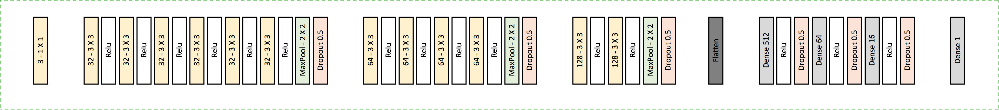
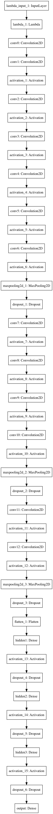
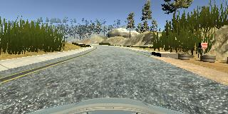
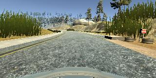
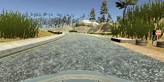

## Project 3 - Behavior Cloning
-------------------------------

###1. Model Architecture Design

First tried with alexnet to extract, but had issues, so continued with training the model from scrach, 
referenced from lots of blogs to come up with less loss.

After few iterations, decided with below Model, which utilizes many convolution layers


  																																																																																		
																																																																																			
																																																																																			
1. Conv Layer with 3 1x1 filter
2. **6** Conv Layes with 32 3x3 filters followed by Maxpool 2x2 and Dropout layer
3. **4** Conv Layes with 64 3x3 filters followed by Maxpool 2x2 and Dropout layer
4. **2** Conv Layes with 128 3x3 filters followed by Maxpool 2x2 and Dropout layer
5. Flatten for FC layers
6. Fully Connected layer with 512 neurons followed by Relu activation layer and droupouts
7. Fully Connected layer with 64 neurons followed by Relu activation layer and droupouts
8. Fully Connected layer with 16 neurons followed by Relu activation layer and droupouts
9. Output FC layer


###2. Architecture Characteristics

This model starts with 3 1x1 filters , which is good for transforming the color space of image, to choose best colour suited.

It is followed my multiple Conv layers of 32, 64 and 128 with 3x3 filters, this to provide depth of the model, and learning.

At last set of layers, is 3 fully connected layers, of 512, 64 and 16 neurons with relu and droputs to provide sensible classification and generalization of model.



###3. Data Preparation

Data is augmented and generated using python generators. So for every epoch, the optimizer practically sees a new and augmented data set.

````{python}
def generate_train_from_PD_batch(data, batch_size=32):
    ## Generator for keras training, with subsampling
    batch_images = np.zeros((batch_size, new_size_row, new_size_col, 3))
    batch_steering = np.zeros(batch_size)
    while 1:
        for i_batch in range(batch_size):
            i_line = np.random.randint(len(data))
            line_data = data.iloc[[i_line]].reset_index()

            keep_pr = 0
            # x,y = preprocess_image_file_train(line_data)
            while keep_pr == 0:
                x, y = preprocess_image_file_train(line_data)
                pr_unif = np.random
                if abs(y) < .15:
                    pr_val = np.random.uniform()
                    if pr_val > pr_threshold:
                        keep_pr = 1
                else:
                    keep_pr = 1

            # x = x.reshape(1, x.shape[0], x.shape[1], x.shape[2])
            # y = np.array([[y]])
            batch_images[i_batch] = x
            batch_steering[i_batch] = y
        yield batch_images, batch_steering

````

For every batch size, data is randomly sampled and image is preprocessed.

Also, the pre-processing includes, resizing and increasing brightness.









###4. Model Training

Tried with different size of learning parameter, from 0.001 to 0.0001, and found to keep the learning parameter 0.0001 provides, faster convergence.
Generated more data and prepossessing, using the same image enhancement suggested by vivek on is blog.

Following were the result of training.
````

Using TensorFlow backend.
Starting to train
Epoch 1/1
  256/20224 [..............................] - ETA: 1971s - loss: 284.2426
  512/20224 [..............................] - ETA: 1336s - loss: 224.5327
  768/20224 [>.............................] - ETA: 1112s - loss: 187.4436
 1024/20224 [>.............................] - ETA: 996s - loss: 165.7107 
 1280/20224 [>.............................] - ETA: 923s - loss: 141.9008
 1536/20224 [=>............................] - ETA: 873s - loss: 123.9223
 1792/20224 [=>............................] - ETA: 831s - loss: 109.6145
 2048/20224 [==>...........................] - ETA: 802s - loss: 98.4939 
 2304/20224 [==>...........................] - ETA: 778s - loss: 89.4979
 2560/20224 [==>...........................] - ETA: 754s - loss: 81.8039
 2816/20224 [===>..........................] - ETA: 735s - loss: 75.3723
 3072/20224 [===>..........................] - ETA: 715s - loss: 69.6806
 3328/20224 [===>..........................] - ETA: 698s - loss: 64.8303
 3584/20224 [====>.........................] - ETA: 682s - loss: 60.5767
 3840/20224 [====>.........................] - ETA: 667s - loss: 56.8168
 4096/20224 [=====>........................] - ETA: 651s - loss: 53.5457
 4352/20224 [=====>........................] - ETA: 637s - loss: 50.5999
 4608/20224 [=====>........................] - ETA: 623s - loss: 47.9517
 4864/20224 [======>.......................] - ETA: 610s - loss: 45.6230
 5120/20224 [======>.......................] - ETA: 596s - loss: 43.4647
 5376/20224 [======>.......................] - ETA: 584s - loss: 41.5224
 5632/20224 [=======>......................] - ETA: 572s - loss: 39.7526
 5888/20224 [=======>......................] - ETA: 560s - loss: 38.1431
 6144/20224 [========>.....................] - ETA: 548s - loss: 36.6442
 6400/20224 [========>.....................] - ETA: 537s - loss: 35.2548
 6656/20224 [========>.....................] - ETA: 525s - loss: 33.9671
 6912/20224 [=========>....................] - ETA: 514s - loss: 32.7693
 7168/20224 [=========>....................] - ETA: 504s - loss: 31.6655
 7424/20224 [==========>...................] - ETA: 493s - loss: 30.6224
 7680/20224 [==========>...................] - ETA: 482s - loss: 29.6518
 7936/20224 [==========>...................] - ETA: 471s - loss: 28.7280
 8192/20224 [===========>..................] - ETA: 461s - loss: 27.8814
 8448/20224 [===========>..................] - ETA: 450s - loss: 27.0729
 8704/20224 [===========>..................] - ETA: 439s - loss: 26.3044
 8960/20224 [============>.................] - ETA: 429s - loss: 25.5913
 9216/20224 [============>.................] - ETA: 418s - loss: 24.9097
 9472/20224 [=============>................] - ETA: 408s - loss: 24.2685
 9728/20224 [=============>................] - ETA: 398s - loss: 23.6607
 9984/20224 [=============>................] - ETA: 388s - loss: 23.0875
10240/20224 [==============>...............] - ETA: 378s - loss: 22.5382
10496/20224 [==============>...............] - ETA: 368s - loss: 22.0176
10752/20224 [==============>...............] - ETA: 358s - loss: 21.5229
11008/20224 [===============>..............] - ETA: 349s - loss: 21.0514
11264/20224 [===============>..............] - ETA: 339s - loss: 20.5981
11520/20224 [================>.............] - ETA: 330s - loss: 20.1614
11776/20224 [================>.............] - ETA: 320s - loss: 19.7455
12032/20224 [================>.............] - ETA: 311s - loss: 19.3467
12288/20224 [=================>............] - ETA: 302s - loss: 18.9639
12544/20224 [=================>............] - ETA: 292s - loss: 18.6005
12800/20224 [=================>............] - ETA: 283s - loss: 18.2473
13056/20224 [==================>...........] - ETA: 274s - loss: 17.9094
13312/20224 [==================>...........] - ETA: 264s - loss: 17.5809
13568/20224 [===================>..........] - ETA: 254s - loss: 17.2636
13824/20224 [===================>..........] - ETA: 244s - loss: 16.9609
14080/20224 [===================>..........] - ETA: 235s - loss: 16.6707
14336/20224 [====================>.........] - ETA: 225s - loss: 16.3868
14592/20224 [====================>.........] - ETA: 215s - loss: 16.1111
14848/20224 [=====================>........] - ETA: 205s - loss: 15.8468
15104/20224 [=====================>........] - ETA: 195s - loss: 15.5931
15360/20224 [=====================>........] - ETA: 186s - loss: 15.3457
15616/20224 [======================>.......] - ETA: 176s - loss: 15.1081
15872/20224 [======================>.......] - ETA: 167s - loss: 14.8780
16128/20224 [======================>.......] - ETA: 157s - loss: 14.6542
16384/20224 [=======================>......] - ETA: 147s - loss: 14.4364
16640/20224 [=======================>......] - ETA: 137s - loss: 14.2265
16896/20224 [========================>.....] - ETA: 127s - loss: 14.0202
17152/20224 [========================>.....] - ETA: 117s - loss: 13.8250
17408/20224 [========================>.....] - ETA: 108s - loss: 13.6327
17664/20224 [=========================>....] - ETA: 98s - loss: 13.4423 
17920/20224 [=========================>....] - ETA: 88s - loss: 13.2599
18176/20224 [=========================>....] - ETA: 78s - loss: 13.0838
18432/20224 [==========================>...] - ETA: 68s - loss: 12.9130
18688/20224 [==========================>...] - ETA: 59s - loss: 12.7448
18944/20224 [===========================>..] - ETA: 49s - loss: 12.5812
19200/20224 [===========================>..] - ETA: 39s - loss: 12.4211
19456/20224 [===========================>..] - ETA: 29s - loss: 12.2672
19712/20224 [============================>.] - ETA: 19s - loss: 12.1161
19968/20224 [============================>.] - ETA: 9s - loss: 11.9690 
20224/20224 [==============================] - 916s - loss: 11.8250 - val_loss: 0.0202
saving model :  model.json  and  model.h5
Model Saved

````
